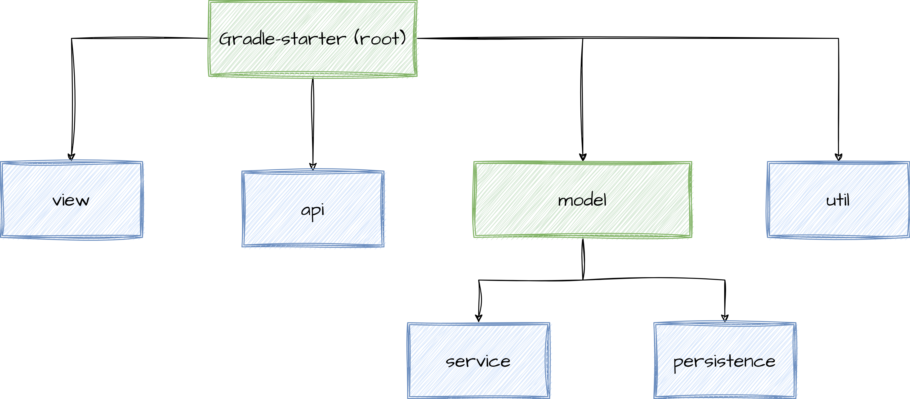

- Создайте multi-project на Gradle в соответствии со схемой
- Подключить ко всем модулям необходимые зависимости, в соответствии с `MVC` архитектурой
- Подключить модуль `util` в `persistence`
- В других модулях `util` должен подключаться как _транзитивная зависимость_
- Во `view` надо исключить подключение `util` как _транзитивной зависимости_
